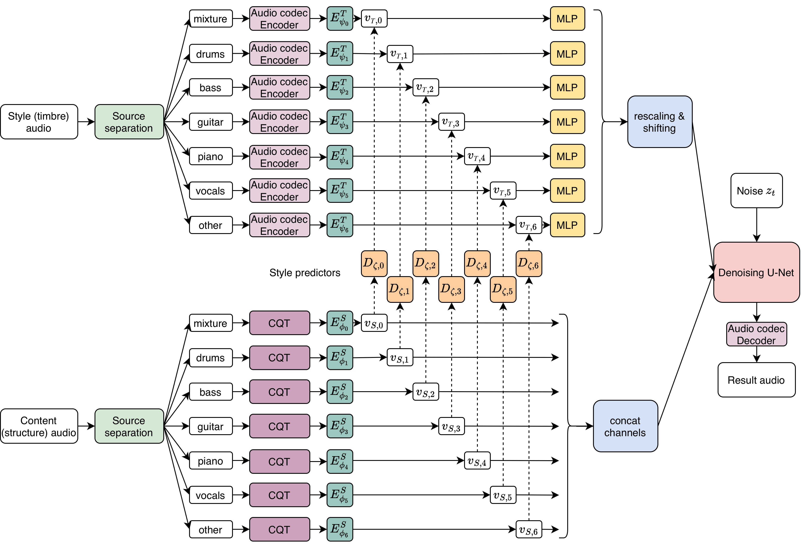
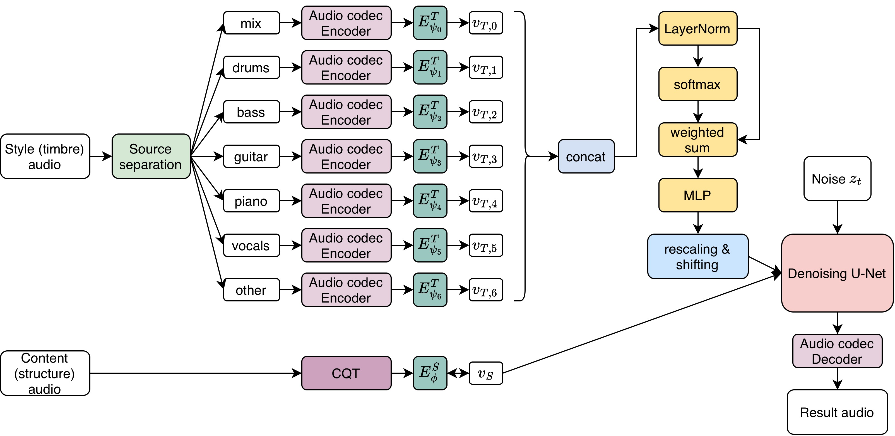

# Automatic Generation of Cover Songs Using Deep Learning

## About the Repository

This repository contains the code, experiments, and demo materials for the coursework project on automatic cover song generation in the audio domain. The project treats cover generation as a music style transfer problem: given an existing track, the goal is to generate a new stylistic version while preserving recognizable musical content.

The core approach is based on a latent diffusion model that disentangles musical structure and style and recombines them in a conditional denoising U-Net. A special focus of this repository is multi-instrument music: in addition to the base pipeline, it includes experiments with source separation, where an input mixture is first decomposed into instrumental stems and then used to condition the diffusion model. The repository includes dataset preprocessing scripts, training pipelines, notebooks for inference, and demo examples.

You can listen to examples [here](https://eyeless-r.github.io/Automatic-Generation-of-Cover-Songs/)

## Credits

This project builds on the original [`control-transfer-diffusion`](https://github.com/NilsDem/control-transfer-diffusion) repository by NilsDem. The current repository adapts and extends that codebase for cover song generation and for experiments with source separation in complex musical mixtures.

Source separation experiments in this repository also rely on [`Demucs`](https://github.com/facebookresearch/demucs), developed by facebookresearch. It is used here as the backbone model for separating input mixtures into instrumental stems before conditioning the diffusion pipeline.

## Architecture

### Base mode



### Advanced mode



## Model training

Prior to training, install the required dependencies using :

```bash
pip install -r "requirements.txt"
```

Fine-tuning the model requires two steps : processing the dataset, then fine-tuning pretrained diffusion model.

### Dataset preparation

(after downloading Slakh2100  [here](http://www.slakh.com/)) :

For train_diffusion.py:
```bash
python dataset/split_to_lmdb.py --input_path slakh2100_flac_redux --output_path lmdb --emb_model_path autoencoder_checkpoints/AE_slakh.pt --slakh_only_tracks
```

For train_with_ss.py:
```bash
python dataset/split_to_lmdb.py --input_path slakh2100_flac_redux --output_path lmdb_ss --emb_model_path autoencoder_checkpoints/AE_slakh.pt --slakh_only_tracks True --source_separation True
```

### Diffusion model fine-tuning
The model training is configured with gin config files.

To fine-tune model without sourse separation:
```bash
python train_diffusion.py --name fine-tune --db_path lmdb --config diffusion/runs/fine-tune/config --emb_model_path autoencoder_checkpoints/AE_slakh.pt --dataset_type waveform --gpu 0 --restart 500000
```

To fine-tune model with sourse separation:
```bash
python train_with_ss.py --name fine-tune --db_path lmdb_ss --config diffusion/runs/fine-tune/config_ss --emb_model_path autoencoder_checkpoints/AE_slakh.pt --dataset_type waveform --gpu 0 --restart 500000
```

<!-- ## Inference and pretrained models

Three pretrained models are currently available : 
1. Audio to audio transfer model trained on [Slakh](http://www.slakh.com/)
2. Audio to audio transfer model trained on multiple datasets (Maestro, URMP, Filobass, GuitarSet...)
3. MIDI-to-audio model trained on [Slakh](http://www.slakh.com/)

You can download the autoencoder and diffusion model checkpoints [here](https://nubo.ircam.fr/index.php/s/8xaXbQtcY4n3Mg9/download). Make sure you copy the pretrained models in `./pretrained`. The notebooks in `./notebooks` demonstrate how to load a model and generate audio from midi and audio files. -->
